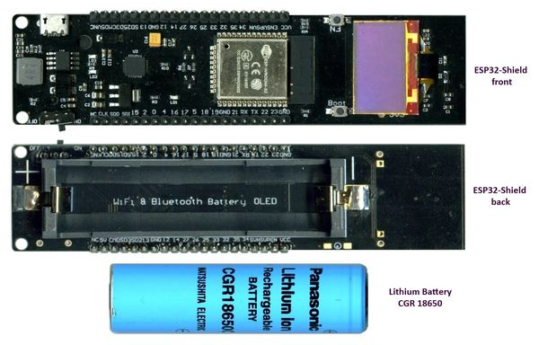
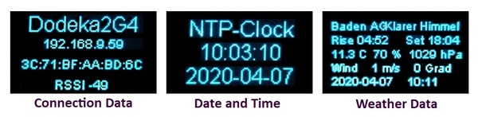

# WiFiWeatherAndClockAuto
Connects via WLAN to openWeatherMap.org and fetches the weather data 
in JSON format, parses the strings with the JSON parser and displays 
the data on the integrated OLED display of the ESP32 module.
Date and Time are also retrieved from a time server.
## Parts

## Displayed Data

## Code
The folder WiFiWeatherAndClockAuto contains the full PlatformIO project.
